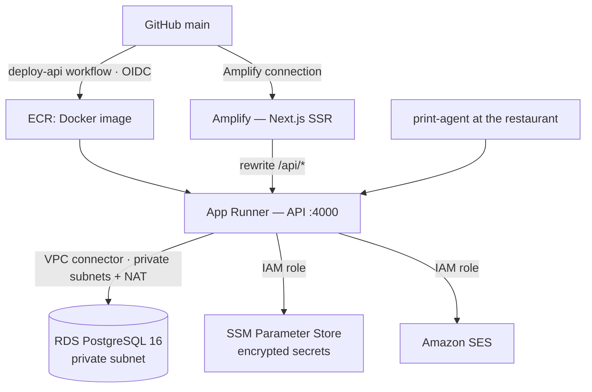

# ComandaPro / Olyda 🍕

> Multi-tenant SaaS for delivery order management, with real ESC/POS thermal printing,
> an online store per restaurant and public order tracking via QR code.

📚 **Full documentation lives in [`docs/`](docs/README.md)** (currently in Spanish). This README
only covers getting started. Before developing, read [`CLAUDE.md`](CLAUDE.md) and
[`docs/08-entorno-desarrollo.md`](docs/08-entorno-desarrollo.md).

## Stack

| Layer                    | Technology                                                                         |
| ------------------------ | ---------------------------------------------------------------------------------- |
| Frontend                 | Next.js 16 (App Router) + React 19 + Tailwind v4                                   |
| Backend                  | Node.js 20 + Express + TypeScript                                                  |
| ORM                      | Prisma 5                                                                           |
| Database                 | PostgreSQL 16                                                                      |
| Printing                 | `@point-of-sale/receipt-printer-encoder` (ESC/POS) + WebUSB / Web Bluetooth / CUPS |
| QR codes and images      | `qrcode` + `jimp`                                                                  |
| Email                    | Amazon SES (IAM role, no stored credentials)                                       |
| Frontend deployment      | AWS Amplify (SSR)                                                                  |
| Backend deployment       | AWS App Runner (Docker + ECR)                                                      |
| Managed database         | AWS RDS PostgreSQL in a private subnet                                             |
| Infrastructure as code   | Terraform (`infra/`), remote state in S3 with DynamoDB locking                     |
| CI/CD                    | GitHub Actions, authenticated to AWS via OIDC (no long-lived keys)                 |

## Architecture



## Quick start (local development)

Requirements: Node.js ≥ 20, Docker Desktop, Chrome or Edge (for WebUSB).

```bash
# 1. Database
docker-compose up -d

# 2. Environment variables
cp .env.example apps/api/.env
cp .env.example apps/web/.env.local     # keep only the NEXT_PUBLIC_* variables

# 3. Backend
cd apps/api
npm install --no-workspaces
npx prisma db push
npm run db:seed
npm run dev            # → http://localhost:4000

# 4. Frontend (in another terminal)
cd apps/web
npm install --no-workspaces
npm run dev            # → http://localhost:3000
```

After seeding you get:

- 🏪 Restaurant **Pizzería Bella Italia** (`slug: pizzeria-bella`)
- 👤 `admin@pizzeria-bella.com` / `admin1234` (local development only)
- 🍕 13 products (one out of stock) and 3 test customers

> ⚠️ **The seed does not open a service.** Go to *Pedidos → Iniciar servicio* (Orders → Start
> service) before creating an order, or the API will respond with `409`.

## Structure

```
comandaPro/
├── apps/
│   ├── api/            Express + Prisma  (routes, services, middleware, prisma)
│   ├── web/            Next.js           (login, register, dashboard, tracking, [slug]/pedidos)
│   └── print-agent/    Local printing agent via CUPS
├── packages/shared-types/   (empty — pending)
├── infra/              Terraform + deployment guide
├── docker/             PostgreSQL init.sql
├── scripts/rollback.sh
├── docs/               📚 Documentation (source of truth)
└── CHANGELOG.md
```

## Thermal printing

The backend generates the complete ESC/POS buffer (logo, customer, items, totals, tracking
QR code and paper cut) and the client transports it to the printer:

| Mode          | Transport                          | Requirements                                                 |
| ------------- | ---------------------------------- | ------------------------------------------------------------ |
| `webusb`      | `navigator.usb` from the browser   | Desktop Chrome/Edge, HTTPS or localhost                      |
| `bluetooth`   | Web Bluetooth (BLE serial)         | Chrome; ⚠️ see known bug in `docs/11-deuda-tecnica.md`       |
| `printserver` | `apps/print-agent` → `lp -o raw`   | CUPS installed at the restaurant                             |

| Paper | Characters per line | Dots |
| ----- | ------------------- | ---- |
| 58 mm | 32                  | 384  |
| 80 mm | 48                  | 576  |

Details and troubleshooting: [`docs/06-impresion.md`](docs/06-impresion.md).

## Multi-tenancy

Each `Business` has a unique `slug`, and all data is isolated by `businessId`. The JWT
includes the `businessId`, and `authMiddleware` re-validates on every request that the user
still has access to that business. See [`docs/10-seguridad.md`](docs/10-seguridad.md).

## Deployment

A push to `main` that touches `apps/api/**` triggers GitHub Actions, which assumes an IAM
role via OIDC, takes an RDS snapshot, builds the image, pushes it to ECR tagged with the
commit SHA and deploys it to App Runner. App Runner only switches traffic once the new
version passes its health check. Amplify builds the frontend from the same repository.

Rollback of the application, or of the application and database, is scripted in
`scripts/rollback.sh`.

Full guide, rollback procedures, runbooks, post-mortems and cost model:
[`docs/09-despliegue.md`](docs/09-despliegue.md).

## API

Summary of endpoint families (full reference in [`docs/04-api-reference.md`](docs/04-api-reference.md)):

| Prefix                 | Auth              | Content                                                          |
| ---------------------- | ----------------- | ---------------------------------------------------------------- |
| `/api/auth`            | 🔓                | Login and business sign-up                                       |
| `/api/services`        | 🔒                | Open and close a service shift                                   |
| `/api/orders`          | 🔒                | Orders, statuses, deletion and **ESC/POS printing**              |
| `/api/products`        | 🔒                | Catalogue and stock                                              |
| `/api/customers`       | 🔒                | Business customers                                               |
| `/api/shipping-rates`  | 🔒                | Delivery rates (write: admin)                                    |
| `/api/settings`        | 🔒                | Business settings (write: admin)                                 |
| `/api/stats`           | 🔒                | Statistics by service, customer, product, category and period    |
| `/api/tracking/:token` | 🔓                | Public order tracking                                            |
| `/api/public/:slug`    | 🔓 / 🔒 customer   | Online store: catalogue, accounts and orders                     |
| `/health`              | 🔓                | Service health                                                   |

## Status and next steps

See [`docs/11-deuda-tecnica.md`](docs/11-deuda-tecnica.md) (prioritised known issues) and
[`docs/12-roadmap.md`](docs/12-roadmap.md) (release plan up to commercial launch).
