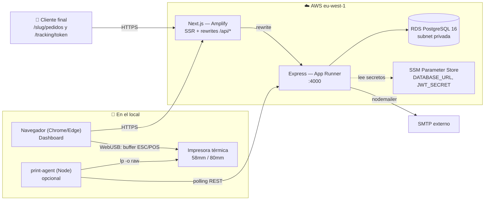
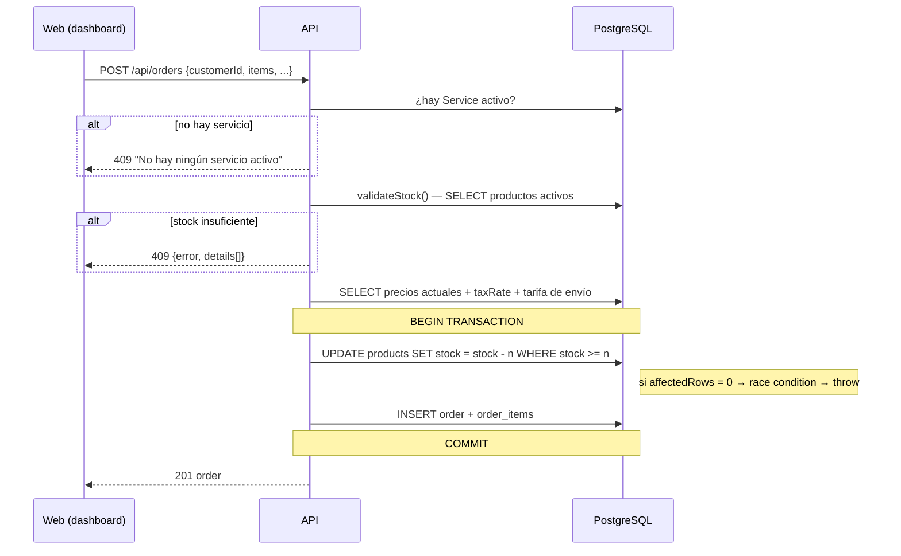
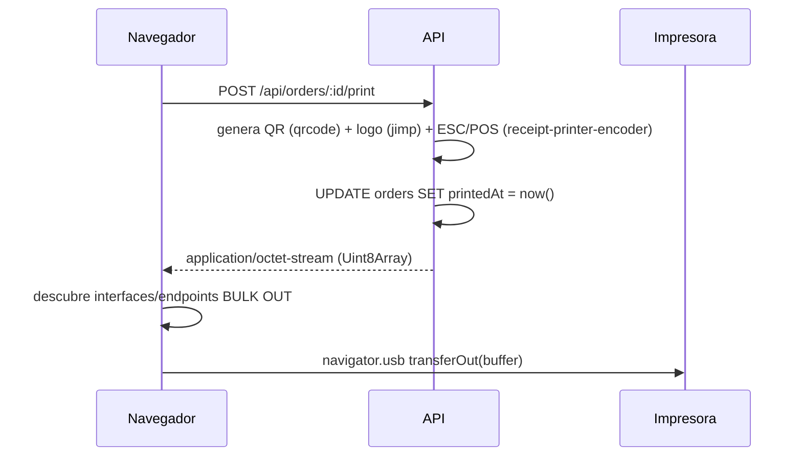
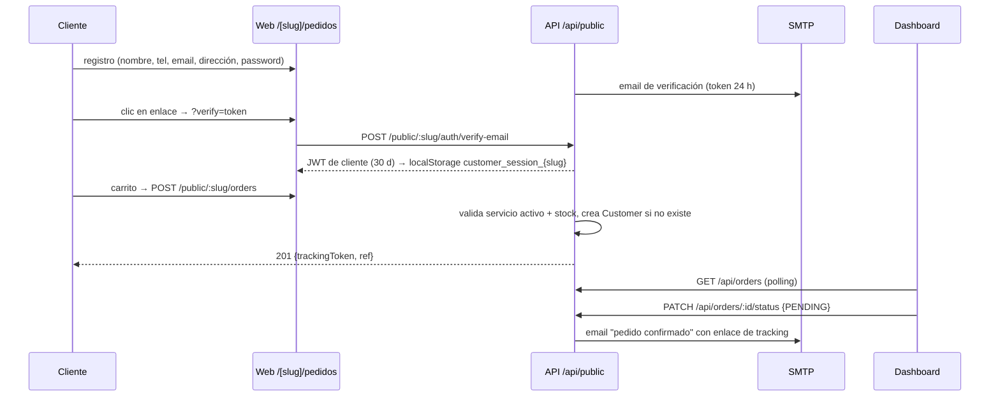

# 02 — Arquitectura

## 1. Vista general

Monorepo npm workspaces orquestado con Turborepo. Tres aplicaciones desplegables y un
paquete compartido (hoy vacío).

```
comandaPro/
├── apps/
│   ├── api/          Express + Prisma + PostgreSQL   → AWS App Runner (Docker)
│   ├── web/          Next.js 16 (App Router)         → AWS Amplify (SSR)
│   └── print-agent/  Proceso Node en el local        → se ejecuta junto a la impresora
├── packages/
│   └── shared-types/ (VACÍO — ver deuda técnica)
├── infra/            Terraform (VPC, RDS, ECR, App Runner, Amplify, SSM)
├── docker/           init.sql de PostgreSQL local
├── scripts/          rollback.sh
└── .github/workflows/deploy-api.yml
```

## 2. Diagrama de componentes



### Punto clave: el navegador nunca llama a la API directamente

`apps/web/next.config.ts` define un **rewrite**: todo `/api/:path*` del frontend se
reescribe a `${NEXT_PUBLIC_API_URL}/api/:path*`. Por eso en el código de las páginas verás
`const API = ''` y llamadas a `fetch('/api/orders')`. Consecuencias:

- No hay problema de CORS en el flujo normal (mismo origen).
- Cambiar el backend de sitio es cambiar una variable de entorno de build.
- El navegador **sí** habla directamente con la impresora (WebUSB), nunca con la BD.

## 3. Responsabilidades por aplicación

### `apps/api` — backend

| Carpeta | Contenido |
|---------|-----------|
| `src/index.ts` | Bootstrap, validación de env obligatorias, CORS manual, helmet, morgan, montaje de rutas, error handler global |
| `src/routes/` | `auth`, `orders`, `products`, `customers`, `settings`, `tracking`, `shipping-rates`, `services`, `stats`, `public` |
| `src/middleware/` | `auth.middleware.ts` (JWT de staff + verificación de pertenencia al tenant, `requireAdmin`), `customer-auth.middleware.ts` (JWT de cliente online) |
| `src/services/` | `printer.service.ts` (ESC/POS), `stock.service.ts` (validar/descontar/restaurar stock), `email.service.ts` (nodemailer + plantillas HTML) |
| `src/prisma/client.ts` | Singleton de PrismaClient |
| `prisma/` | `schema.prisma`, `seed.ts`, `migrations/` |

Patrón de ruta estándar:

```ts
router.use(authMiddleware);                    // 1. Autenticación + tenant
const schema = z.object({ ... });              // 2. Validación con Zod
const parsed = schema.safeParse(req.body);     // 3. safeParse, nunca parse
if (!parsed.success) { res.status(400)...; }
const x = await prisma.x.findFirst({           // 4. SIEMPRE filtrar por businessId
  where: { id: req.params.id, businessId: req.businessId! },
});
```

### `apps/web` — frontend

Next.js 16 con App Router, todo en Client Components (`'use client'`), Tailwind v4
instalado pero **el estilo real se escribe con variables CSS en `globals.css` y estilos
inline**. Rutas en [05-frontend.md](05-frontend.md).

### `apps/print-agent` — agente de impresión local

Proceso Node sin dependencias más allá de `dotenv`. Hace login con credenciales de un
usuario del local, hace polling cada `PRINT_AGENT_POLL_INTERVAL_MS` (5 s por defecto) a
`GET /api/orders?status=PENDING&notPrinted=true&limit=10`, pide el buffer a
`POST /api/orders/:id/print`, lo escribe en un fichero temporal y lo manda a CUPS con
`lp -d <PRINTER_NAME> -o raw`.

## 4. Flujos críticos

### 4.1 Creación de pedido con control de stock



**Invariante:** el precio se congela en `OrderItem.unitPrice` en el momento de la creación.
Cambiar el precio de un producto no altera pedidos ya creados.

### 4.2 Impresión



Alternativa sin WebUSB: el `print-agent` hace el mismo `POST` y envía a CUPS.
Detalles y troubleshooting en [06-impresion.md](06-impresion.md).

### 4.3 Venta online



## 5. Modelo multi-tenant

**Estrategia: base de datos compartida, esquema compartido, discriminador por columna
(`businessId`).**

- El JWT de staff contiene `{ userId, businessId, role }`.
- `authMiddleware` no confía solo en el token: **releé `BusinessUser` en cada petición**
  para confirmar que el usuario sigue teniendo acceso, y toma el `role` de la BD (no del
  token). Esto permite revocar accesos sin esperar a que caduque el token.
- Toda consulta debe llevar `businessId` en el `where`. No hay Row Level Security en
  PostgreSQL: **el aislamiento depende exclusivamente de la disciplina en cada query**.

Riesgos y mitigaciones en [10-seguridad.md](10-seguridad.md).

## 6. Decisiones estructurales vigentes

| Decisión | Motivo | ADR |
|----------|--------|-----|
| Monorepo con Turborepo | Compartir tipos y despliegue coordinado de 3 apps | [0001](adr/0001-monorepo-turborepo.md) |
| Multi-tenant por columna, no por esquema/BD | Coste y simplicidad operativa en fase temprana | [0003](adr/0003-multitenant-columna-discriminadora.md) |
| ESC/POS generado en servidor, transporte en cliente | El servidor no ve la impresora; el navegador no sabe maquetar tickets | [0002](adr/0002-impresion-escpos-servidor.md) |
| El "Servicio" como unidad de trabajo y de análisis | Refleja el turno real del local y permite cierre de caja | [0004](adr/0004-servicio-como-unidad-de-trabajo.md) |
| AWS App Runner + Amplify + RDS | Free tier, sin gestionar servidores, escalado automático | [0005](adr/0005-aws-apprunner-amplify-rds.md) |
| JWT en `localStorage`, sin refresh token | Simplicidad del MVP | [0006](adr/0006-jwt-en-localstorage.md) — **a revisar** |

## 7. Lo que la arquitectura NO resuelve hoy

- **Tiempo real**: no hay WebSocket ni SSE. El dashboard y el print-agent hacen polling.
  Un pedido online puede tardar segundos en aparecer.
- **Colas / trabajos en segundo plano**: los emails se envían con `.catch(console.error)`
  dentro del request. Si el SMTP falla, el email se pierde sin reintento.
- **Almacenamiento de imágenes**: `logoUrl` e `imageUrl` son URLs externas; no hay subida
  de ficheros (aunque `multer` está instalado sin usar y hay un `s3.tf` en `infra/`).
- **Observabilidad**: solo `morgan` a stdout. Sin métricas, sin trazas, sin alertas.
- **Idempotencia**: `POST /api/orders` no acepta clave de idempotencia; un doble clic con
  red lenta puede duplicar un pedido y descontar stock dos veces.
