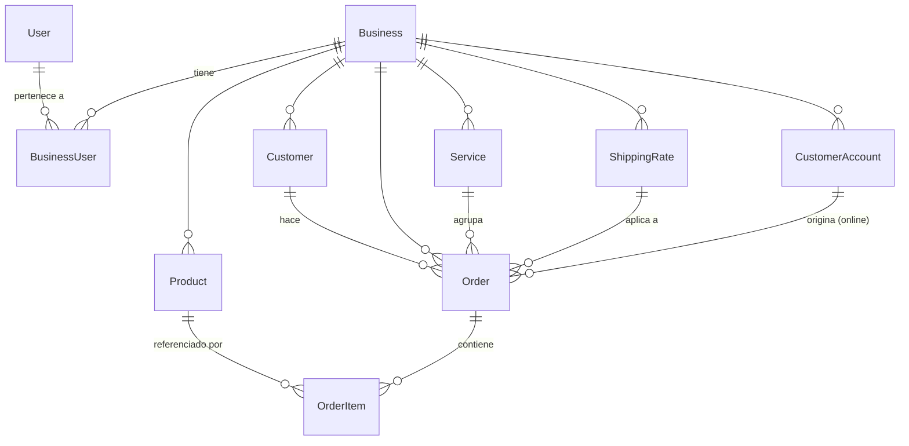

# 03 — Modelo de datos

Fuente de verdad: [`apps/api/prisma/schema.prisma`](../apps/api/prisma/schema.prisma).
PostgreSQL 16. Todos los IDs son `cuid()`.

## 1. Diagrama entidad-relación



## 2. Entidades

### `Business` — el tenant

| Campo | Tipo | Notas |
|-------|------|-------|
| `slug` | `String @unique` | Identificador público. Usado en login, tienda online y URLs |
| `logoUrl`, `phone`, `address` | `String?` | Salen impresos en el ticket |
| `paperWidth` | `Int = 80` | 58 u 80 mm. Determina caracteres y dots por línea |
| `printerMode` | `String = "webusb"` | `"webusb"` \| `"printserver"` |
| `printServerUrl` | `String?` | Solo si `printerMode = "printserver"` |
| `currency` | `String = "EUR"` | ISO-4217, 3 letras |
| `taxRate` | `Float = 0` | Porcentaje de IVA. Se aplica **sobre el subtotal, no sobre el envío** |
| `onlineOrderEnabled` | `Boolean = false` | Interruptor de la tienda pública `/[slug]/pedidos` |

> `printerMode` lo lee el **frontend** (`/dashboard/orders`) para elegir entre WebUSB y
> Bluetooth. El **backend lo ignora por completo**, y `printServerUrl` no lo consulta nadie:
> el `print-agent` hace polling con independencia de la configuración del local.
> Además, el valor `bluetooth` que ofrece la interfaz no es aceptado por la API
> ([bug P0-1](11-deuda-tecnica.md#p0-bluetooth)).

### `User` + `BusinessUser` — usuarios de staff

Relación N:M explícita. Un `User` (identificado globalmente por `email` único) puede
pertenecer a varios `Business` con un `Role` distinto en cada uno.

```
User ──< BusinessUser >── Business
              │
              └─ role: OWNER | ADMIN | STAFF
```

- **Login** requiere `email + password + businessSlug`: el usuario elige explícitamente el
  local. No existe pantalla de "elegir local" tras autenticarse.
- **No hay endpoint para invitar/crear usuarios adicionales.** El único `User` que se crea
  es el `OWNER` en `POST /api/auth/register`. Añadir un `STAFF` hoy requiere tocar la BD.
  Es el gap funcional más grande para vender a locales con varios empleados.

### `Product`

| Campo | Notas |
|-------|-------|
| `price` | `Decimal(10,2)` — se convierte a `Number` en la API (ver §5) |
| `stock` | `Int`. Se descuenta al crear pedido y se restaura al borrarlo |
| `active` | Soft delete: `DELETE /api/products/:id` solo pone `active = false` |
| `onlineVisible` | Debe ser `true` **y** `stock > 0` para aparecer en la tienda pública |
| `category` | `String?` libre. No hay tabla de categorías; se agrupan por string |

Índices: `[businessId]`, `[businessId, active]`.

### `Customer` — ficha de cliente del local

- `@@unique([businessId, phone])` — **el teléfono es la clave natural**. Todo el flujo
  rápido de comanda depende de esto (`GET /api/customers/by-phone/:phone`).
- No tiene borrado. La relación `Order.customer` es obligatoria y sin `onDelete`, así que
  PostgreSQL impediría borrar un cliente con pedidos.

### `Order`

| Campo | Notas |
|-------|-------|
| `trackingToken` | `@unique @default(cuid())`. Da acceso público de lectura sin auth |
| `status` | Enum de 7 estados, ver [07-flujos-negocio.md](07-flujos-negocio.md) |
| `serviceId` | `String?` — nulo solo si se creó fuera de un servicio (no debería ocurrir) |
| `customerAccountId` | `String?` — presente solo en pedidos online |
| `subtotal`, `tax`, `shippingCost`, `total` | `Decimal(10,2)` calculados en el servidor |
| `isPickup` | `true` = recogida en local (sin envío ni dirección) |
| `deliveryAddress` | Si es nulo, el tracking cae a `customer.address` |
| `paymentMethod` | `CASH` \| `CARD` — informativo, no hay cobro real |
| `cashGiven` | Efectivo entregado; el cambio se calcula al imprimir, no se persiste |
| `printedAt` | Marca de impresión. Lo usa el `print-agent` (`notPrinted=true`) |

Índices: `[businessId]`, `[businessId, status]`, `[businessId, serviceId]`, `[trackingToken]`.

> ⚠️ **No hay índice sobre `createdAt`**, y `GET /api/orders` y `/api/stats/period` ordenan
> y filtran por esa columna.

### `OrderItem`

Congela `unitPrice` y `subtotal` en el momento de la compra. `product` es obligatorio y sin
`onDelete`, por eso los productos usan borrado lógico.

### `Service` — turno de trabajo

```
startedAt (obligatorio) ── endedAt (null = ACTIVO)
```

Invariante de negocio: **como máximo un `Service` con `endedAt = null` por `Business`**.
Se garantiza a nivel de aplicación (`POST /api/services/start` devuelve 409 si ya existe),
**no a nivel de base de datos**. Un índice único parcial lo haría infalible:

```sql
CREATE UNIQUE INDEX one_active_service_per_business
  ON services ("businessId") WHERE "endedAt" IS NULL;
```

### `ShippingRate`

Tarifas planas con nombre. `active = false` las oculta sin borrarlas (pero
`DELETE /api/shipping-rates/:id` sí borra físicamente, y fallaría si hay pedidos que la
referencian... salvo que `shippingRateId` es opcional, con lo que PostgreSQL restringe el
borrado igualmente → **error 500 no controlado**).

### `CustomerAccount` — cuenta del comensal (venta online)

- `@@unique([businessId, email])` — **una cuenta por local**, no global. Un cliente que
  compra en dos locales se registra dos veces.
- `verifyToken` + `verifyExpiresAt` (24 h) para la verificación por email.
- Se enlaza con un `Customer` del local por teléfono en el momento del primer pedido.

## 3. Invariantes que el código asume

| # | Invariante | Dónde se garantiza | Riesgo |
|---|------------|--------------------|--------|
| I1 | Todo dato pertenece a un `businessId` | En cada `where` de Prisma | Alto: un olvido filtra datos entre tenants |
| I2 | Máximo un servicio activo por local | `routes/services.ts` (aplicación) | Medio: condición de carrera |
| I3 | `stock >= 0` siempre | `UPDATE ... WHERE stock >= n` en `stock.service.ts` | Bajo: bien resuelto |
| I4 | Un teléfono = un cliente por local | Índice único en BD | Bajo |
| I5 | `total = subtotal + tax + shippingCost` | Cálculo en la ruta | Medio: aritmética en float |
| I6 | El precio del pedido no cambia a posteriori | `OrderItem.unitPrice` | Bajo |

## 4. Migraciones

```bash
# Desarrollo: crea el fichero de migración y lo aplica
npm run db:migrate --workspace=api      # prisma migrate dev

# Producción: se aplica automáticamente al arrancar el contenedor
# (CMD: npx prisma migrate deploy && node dist/index.js)
```

**Estado actual:** solo existe `20260511121906_init`. Todo el esquema posterior se ha
aplicado con `prisma db push`, lo que significa que **el historial de migraciones no
refleja la realidad de la base de datos de producción**.

### Regla a partir de ahora

1. Nunca `db push` contra producción.
2. Todo cambio de esquema → `prisma migrate dev --name descripcion_corta` y el `.sql`
   entra en el PR.
3. Antes de desplegar una migración destructiva, verifica que el snapshot de RDS
   pre-deploy del workflow se ha creado (ver [09-despliegue.md](09-despliegue.md)).
4. Migraciones en dos fases para cambios incompatibles (añadir columna nullable → backfill
   → hacerla obligatoria), porque App Runner despliega sin ventana de mantenimiento.

## 5. Decimales y dinero — cuidado

Prisma devuelve `Decimal` para las columnas monetarias, pero **todo el código lo convierte
a `Number` (float de 64 bits) para calcular**:

```ts
const subtotal = orderItems.reduce((sum, i) => sum + i.subtotal, 0);
const tax      = subtotal * ((business?.taxRate ?? 0) / 100);
const total    = subtotal + tax + shippingCost;   // ← float
```

No hay redondeo explícito a 2 decimales antes de persistir. Prisma/PostgreSQL redondea al
guardar en `Decimal(10,2)`, así que `total` almacenado puede diferir en 1 céntimo de
`subtotal + tax + shippingCost` almacenados. Con IVA del 10 % y varios artículos es
reproducible.

**Recomendación (v1.1):** calcular en céntimos enteros o con `Prisma.Decimal`, y redondear
a 2 decimales con `Math.round(x * 100) / 100` antes de escribir. Ver
[11-deuda-tecnica.md](11-deuda-tecnica.md#p1-dinero).

## 6. Datos de ejemplo (seed)

`apps/api/prisma/seed.ts` crea:

- Local **Pizzería Bella Italia** (`slug: pizzeria-bella`, IVA 10 %, papel 80 mm)
- Usuario `admin@pizzeria-bella.com` / `admin1234` con rol `OWNER`
- 13 productos en 5 categorías (uno con stock 0) y 3 clientes

El seed es idempotente (`upsert`). **No crea un `Service` activo**, así que tras el seed hay
que abrir servicio en el dashboard antes de poder crear pedidos.
