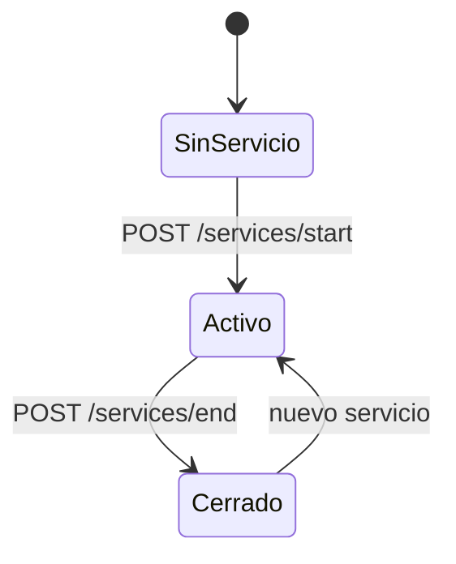
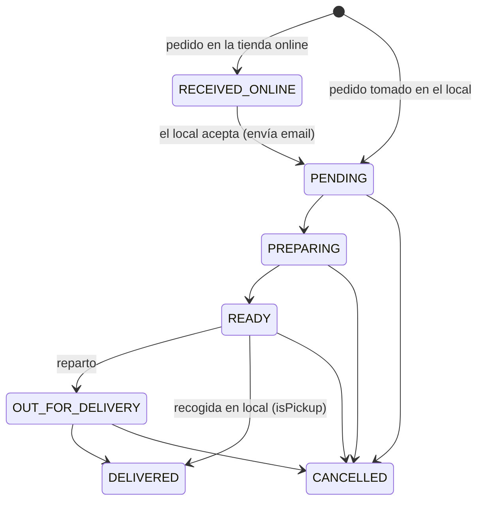

# 07 — Flujos de negocio

Reglas funcionales que el código da por sentadas. Si cambias una, actualiza este documento
en el mismo PR.

## 1. El servicio (turno) es el eje



| Regla | Implementación |
|-------|----------------|
| Máximo un servicio activo por local | `POST /services/start` → 409 si ya existe |
| No se pueden crear pedidos sin servicio activo | `POST /api/orders` y `POST /public/:slug/orders` → 409 |
| La tienda online se muestra "cerrada" sin servicio activo | `GET /public/:slug` devuelve `serviceActive: false` |
| El listado de pedidos solo muestra el servicio activo | `GET /api/orders` filtra por `serviceId` |
| Al cerrar el servicio, todo lo no cancelado pasa a `DELIVERED` | `POST /services/end`, en transacción |
| Un servicio cerrado es la unidad de análisis | `GET /api/stats/services`, `/stats/service/:id` |

### Consecuencias prácticas

- **Olvidarse de cerrar el servicio** infla las estadísticas de ese turno con los pedidos
  del día siguiente. No hay cierre automático ni aviso.
- **Cerrar el servicio "entrega" pedidos que quizá se perdieron.** Es una simplificación
  deliberada del cierre de caja, pero distorsiona la tasa real de entrega.
- Los pedidos `RECEIVED_ONLINE` se muestran **aunque pertenezcan a otro servicio**, para no
  perder ventas que entraron mientras se cambiaba de turno.

> Mejora propuesta (v1.1): al cerrar, preguntar qué hacer con los pedidos abiertos
> (entregar / cancelar / mover al siguiente servicio) en vez de asumir `DELIVERED`.

## 2. Ciclo de vida del pedido



| Estado | Significado | Color en UI |
|--------|-------------|-------------|
| `RECEIVED_ONLINE` | Llegó por la tienda online, pendiente de aceptar | morado |
| `PENDING` | Aceptado / recibido | ámbar |
| `PREPARING` | En cocina | naranja |
| `READY` | Listo | verde |
| `OUT_FOR_DELIVERY` | En reparto | cian |
| `DELIVERED` | Entregado | gris |
| `CANCELLED` | Cancelado | rojo |

**La API no valida las transiciones**: `PATCH /orders/:id/status` acepta cualquier estado
del enum. La secuencia solo se guía desde la UI (`STATUS_CONFIG[...].next`).
Endurecerlo es una mejora pendiente de bajo coste y alto valor.

### Efectos laterales por transición

| Transición | Efecto |
|------------|--------|
| `RECEIVED_ONLINE → PENDING` | Email "pedido confirmado" al `customerAccount` (si tiene email) |
| Cualquiera → `CANCELLED` | **No restaura el stock** (solo lo hace `DELETE /orders/:id`) |
| `DELETE /orders/:id` | Restaura stock y borra físicamente el pedido |

> 🐞 **Incoherencia de negocio:** cancelar no devuelve stock, pero borrar sí. Un pedido
> cancelado deja producto "consumido" que nunca vuelve al inventario.
> Ver [11-deuda-tecnica.md](11-deuda-tecnica.md#p1-stock-cancelado).

## 3. Gestión de stock

```
validateStock()  →  lectura, sin bloqueo, para dar un error legible al usuario
deductStock()    →  UPDATE ... WHERE stock >= n  dentro de la transacción
                    si affectedRows = 0 → throw (alguien se adelantó)
restoreStock()   →  increment, solo al borrar un pedido
```

- El descuento es **atómico y seguro frente a concurrencia**: la condición `stock >= n` va
  en el propio `UPDATE`, no en una lectura previa.
- Solo se pueden pedir productos con `active = true`.
- El stock **no se repone automáticamente** al abrir un servicio: es un inventario real,
  no una disponibilidad diaria. Muchos locales de comida quieren lo segundo → considerar un
  campo `trackStock: boolean` por producto (v1.1).
- En el flujo de nueva comanda, si falta stock, se puede reponer desde un modal sin salir.

## 4. Cálculo de importes

```
subtotal      = Σ (unitPrice × quantity)          precios congelados al crear
tax           = subtotal × (business.taxRate / 100)   ← el envío NO lleva IVA
shippingCost  = tarifa seleccionada (0 si recogida)
total         = subtotal + tax + shippingCost
cambio        = cashGiven − total                 (solo se calcula al imprimir, no se guarda)
```

- El precio se toma **del servidor** en el momento de crear el pedido; el cliente no puede
  imponer precios.
- Aritmética en coma flotante; posible descuadre de 1 céntimo. Ver
  [03-modelo-datos.md §5](03-modelo-datos.md#5-decimales-y-dinero--cuidado).
- No existen descuentos, promociones, propinas ni redondeos configurables.

## 5. Reparto vs. recogida

| | `isPickup = false` (reparto) | `isPickup = true` (recogida) |
|---|---|---|
| Dirección | `deliveryAddress` o la del cliente | no aplica |
| Tarifa de envío | seleccionable | no se aplica |
| Estados | … → `READY` → `OUT_FOR_DELIVERY` → `DELIVERED` | … → `READY` → `DELIVERED` |
| Repartidor | asignable | **nunca**: `/assign` devuelve `409` |

### Quién mueve el pedido en el tramo final

Un pedido a domicilio se puede asignar a un repartidor desde el listado de pedidos, en
cualquier momento antes de cerrarse. Asignar **no** cambia el estado: sirve para repartir
el trabajo mientras cocina todavía está preparando.

A partir de ahí el tramo final lo conduce el repartidor desde `/reparto`:

```
  (mostrador asigna)         (repartidor)          (repartidor)
        │                         │                      │
     PREPARING ──► READY ──► OUT_FOR_DELIVERY ──► DELIVERED
```

El mostrador conserva las mismas transiciones que antes —puede sacar y entregar un pedido
él mismo, por ejemplo si el repartidor se queda sin batería—. Lo que **no** puede hacer el
repartidor es cancelar, devolver el pedido a cocina ni tocar pedidos que no sean suyos.

**De dónde sale la dirección que ve el repartidor.** `Order.deliveryAddress` solo se
rellena cuando alguien escribe una distinta de la habitual; la pantalla de nueva comanda
no lo envía, así que en la práctica casi siempre está vacío y la dirección real vive en
`Customer.address`. La API resuelve las dos y devuelve un único campo ya decidido:

```
Order.deliveryAddress  ??  Customer.address  ??  null
```

Si no hay ninguna, la pantalla lo dice —«Sin dirección, llama al cliente»— en lugar de
dejar un hueco en blanco. La dirección enlaza con `maps/dir/?api=1&destination=`, que abre
la navegación directamente en vez de una búsqueda.

> ⚠️ La dirección **no se congela** en el pedido, a diferencia de `OrderItem.unitPrice`.
> Si el cliente cambia la suya, los pedidos antiguos pasan a mostrar la nueva. Para el
> reparto en curso da igual, pero conviene tenerlo presente antes de usar el histórico
> para cualquier cosa que dependa de dónde se entregó de verdad.

Reasignar en caliente funciona: el pedido desaparece de la pantalla del anterior y aparece
en la del nuevo en el siguiente refresco (20 s).

## 6. Venta online

### Registro del cliente

1. `POST /public/:slug/auth/register` con nombre, teléfono, email, dirección y contraseña
   (mínimo 6 caracteres).
2. Se genera `verifyToken` (32 bytes aleatorios) con 24 h de validez y se envía email.
3. El enlace apunta a `/{slug}/pedidos?verify=<token>`; el frontend hace
   `POST /auth/verify-email` y recibe un **JWT de 30 días**.
4. Si el email ya existe sin verificar, se **reenvía** el correo (respuesta 409 con
   `code: "EMAIL_UNVERIFIED"`).

> El registro revela si un email existe en el local (mensajes distintos) → enumeración de
> usuarios. Aceptable para el MVP, a corregir antes de escalar.

### Pedido online

- Solo productos con `active && onlineVisible && stock > 0`.
- Requiere servicio activo, si no: 409 "El comercio está cerrado en este momento".
- Se crea (o reutiliza) un `Customer` del local buscando por teléfono de la cuenta.
- Nace en estado `RECEIVED_ONLINE` y **descuenta stock inmediatamente**, antes de que el
  local lo acepte. Si el local lo rechaza (cancela), el stock no vuelve → ver §2.
- **El pago no se cobra**: `paymentMethod` es una declaración de intención.

### Aceptación por el local

El dashboard destaca los pedidos online y ofrece un botón de aceptar que hace
`PATCH /status → PENDING`, lo que dispara el email de confirmación con el enlace de
seguimiento.

## 7. Seguimiento público

- El QR del ticket y el email llevan a `/tracking/{trackingToken}`.
- Muestra estado, artículos, total, datos de contacto del local y dirección de entrega.
- **No caduca y no requiere autenticación**: quien tenga la URL ve el nombre y la dirección
  del cliente. Considerar caducidad (p. ej. 30 días tras la entrega) por RGPD.

## 8. Matriz de reglas rápidas (referencia)

| Pregunta | Respuesta |
|----------|-----------|
| ¿Puedo pedir sin servicio abierto? | No, ni en local ni online |
| ¿Puedo pedir un producto sin stock? | No |
| ¿Puedo pedir un producto inactivo? | No |
| ¿Puedo pedir un producto no visible online, desde la tienda online? | No aparece en el catálogo, pero **la API no lo bloquea si conoces el id** ⚠️ |
| ¿Cambia el precio de un pedido si cambio el del producto? | No |
| ¿Cancelar devuelve stock? | No |
| ¿Borrar un pedido devuelve stock? | Sí, y borra el histórico |
| ¿Se puede reimprimir? | Sí, desde el listado de pedidos |
| ¿Se cobra online? | No |
