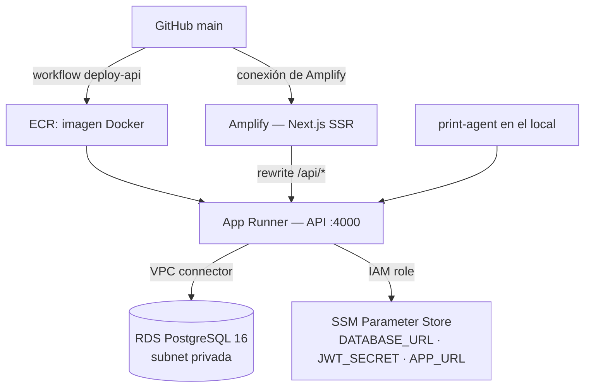

# 09 — Despliegue y operación

Región AWS: **eu-west-1 (Irlanda)**. Infraestructura declarada en `infra/` con Terraform.
Guía original de creación desde cero: [`infra/DEPLOY.md`](../infra/DEPLOY.md).

## 1. Topología en producción



| Recurso | Fichero Terraform | Notas |
|---------|-------------------|-------|
| VPC, subredes, IGW, SG | `vpc.tf` | RDS en subred privada, sin IP pública |
| RDS PostgreSQL 16 | `rds.tf` | `db.t3.micro` por defecto, `db_multi_az = false` |
| ECR + política de ciclo de vida | `ecr.tf` | |
| App Runner + conector VPC | `apprunner.tf` | 0.25 vCPU / 0.5 GB por defecto |
| Amplify | `amplify.tf` | Conexión con GitHub hecha **a mano** desde la consola |
| Roles y políticas IAM | `iam.tf` | Acceso a ECR y lectura de SSM |
| Parámetros cifrados | `ssm.tf` | `DATABASE_URL`, `JWT_SECRET` |
| Bucket S3 | `s3.tf` | Reservado; hoy no se usa desde el código |

> ⚠️ `infra/terraform.tfstate` está en `.gitignore` pero **existe en local**. El estado no
> está en backend remoto: si trabaja más de una persona, migrar a S3 + DynamoDB lock es
> prioritario. Ver [11-deuda-tecnica.md](11-deuda-tecnica.md).

### 🚨 Deriva entre Terraform y el servicio vivo

Comprobado el 2026-08-06 con `aws apprunner describe-service`:

| Variable | Declarada en `apprunner.tf` | Presente en el servicio vivo |
|----------|:---------------------------:|:----------------------------:|
| `NODE_ENV`, `APP_URL`, `ALLOWED_ORIGINS`, `ASSETS_BUCKET`, `ASSETS_BASE_URL` | ✅ | ✅ |
| `SMTP_HOST`, `SMTP_PORT`, `SMTP_SECURE`, `SMTP_USER`, `SMTP_PASS`, `SMTP_FROM` | ❌ | ✅ (añadidas a mano por consola) |

**Un `terraform apply` borraría las seis variables de SMTP** y el envío de correos dejaría
de funcionar. Y lo haría **en silencio**: `email.service.ts` traga los errores con
`.catch(console.error)`, así que no habría ni un 500 — simplemente los clientes dejarían de
recibir la verificación de cuenta y la confirmación de pedido.

**Antes de volver a ejecutar Terraform contra esta infraestructura:** llevar la
configuración de SMTP a `infra/apprunner.tf` (y `SMTP_PASS` a SSM, ver
[A12](10-seguridad.md)), o ejecutar `terraform plan` y revisar línea por línea lo que
pretende eliminar.

## 2. Despliegue del backend (automático)

`.github/workflows/deploy-api.yml` se dispara en push a `main` que toque `apps/api/**`:

1. **Snapshot de RDS previo** — `comandapro-db-predeploy-<timestamp>-<sha>`.
2. **Registra la imagen anterior** para poder revertir.
3. **Build y push** a ECR con dos etiquetas: `<sha>` y `latest`.
4. **`aws apprunner start-deployment`**.
5. **Espera** hasta 5 minutos a que el servicio quede en `RUNNING`.
6. **Resumen** en GitHub con las órdenes exactas de rollback.

Secretos requeridos en GitHub: `AWS_ACCESS_KEY_ID`, `AWS_SECRET_ACCESS_KEY`,
`RDS_DB_IDENTIFIER`, `ECR_REPOSITORY_NAME`, `APPRUNNER_SERVICE_ARN`.

### Migraciones de base de datos

El contenedor arranca con:

```
npx prisma migrate deploy && node dist/index.js
```

Es decir, **las migraciones se aplican en cada despliegue, sin ventana de mantenimiento**.
Consecuencias:

- Una migración que bloquee una tabla grande deja la API caída mientras dura.
- Si la migración falla, el contenedor no arranca y App Runner mantiene la versión anterior
  (buen comportamiento por defecto), pero la base ya puede estar a medias.
- **Regla:** migraciones siempre compatibles hacia atrás (columna nueva nullable → desplegar
  código → backfill → restringir en un segundo despliegue).

## 3. Despliegue del frontend

AWS Amplify conectado a GitHub, configuración en `amplify.yml`:

- `appRoot: apps/web`
- Instala manualmente los binarios nativos de Linux de Tailwind v4 y `lightningcss` y los
  copia a mano, porque Amplify no ejecuta `postinstall`. **No toques ese bloque sin probar
  el build completo**: es la causa de varios despliegues rotos históricos.
- Artefacto: `.next`, con caché de `.next/cache`.

`NEXT_PUBLIC_API_URL` y `NEXT_PUBLIC_APP_URL` se configuran como variables de entorno en la
consola de Amplify (se incrustan en el bundle **en tiempo de build**: cambiarlas exige
reconstruir).

**CORS:** la lista blanca vive en `ALLOWED_ORIGINS`. La configuración que manda en
producción es la de `infra/apprunner.tf` (`runtime_environment_variables`), porque el
despliegue es por imagen ECR; `apps/api/apprunner.yaml` solo aplicaría si App Runner
construyese desde el código.

> ⚠️ **La tienda online llama a la API entre orígenes distintos** (usa
> `NEXT_PUBLIC_API_URL` en absoluto). Si cambia el dominio desde el que se sirve la tienda,
> hay que añadirlo a `ALLOWED_ORIGINS` **antes** de desplegar, o los clientes finales dejan
> de poder pedir. Para comprobar la configuración viva:
>
> ```bash
> aws apprunner describe-service --service-arn "$APPRUNNER_SERVICE_ARN" \
>   --query 'Service.SourceConfiguration.ImageRepository.ImageConfiguration.RuntimeEnvironmentVariables'
> ```
>
> Si la variable no estuviera definida, la API se repliega al origen de `APP_URL` en lugar
> de abrirse a todo el mundo.

## 4. Rollback

### Aplicación

```bash
./scripts/rollback.sh <SHA_ANTERIOR>
```

Requiere `AWS_REGION`, `ECR_REGISTRY`, `ECR_REPOSITORY_NAME`, `APPRUNNER_SERVICE_ARN`.
El script verifica que la imagen exista en ECR, la re-etiqueta como `latest` y lanza el
despliegue.

### Aplicación + base de datos

```bash
./scripts/rollback.sh <SHA_ANTERIOR> <SNAPSHOT_ID>
```

Restaurar un snapshot de RDS **crea una instancia nueva**: hay que repuntar
`DATABASE_URL` en SSM y redesplegar. Es una operación con pérdida de datos desde el
snapshot; úsala solo ante corrupción real.

## 5. Comprobaciones tras desplegar

```bash
curl -s https://<app-runner-host>/health
curl -s https://<app-runner-host>/api/public/<slug-de-un-local-con-tienda>
```

Y en el frontend: login → abrir servicio → crear pedido de prueba → imprimir → borrarlo.

## 6. Runbooks

### La API responde 500 en todo

1. Logs de App Runner en CloudWatch: `[Error]` incluye mensaje y stack.
2. Comprueba que las tres variables obligatorias existen (si falta una, el proceso muere al
   arrancar con `[startup] Missing required env vars`).
3. Comprueba la conectividad con RDS (grupo de seguridad y conector VPC).

### La base de datos no acepta conexiones

App Runner se conecta por el conector VPC. Revisa el grupo de seguridad de RDS
(`aws_security_group.rds`) y que el número de conexiones no esté agotado — Prisma abre un
pool por instancia y App Runner escala instancias: **con autoescalado agresivo se puede
agotar `max_connections` de una `db.t3.micro`**. Mitigación: limitar `connection_limit` en
la `DATABASE_URL` (`?connection_limit=5`) y acotar el máximo de instancias.

### Un local no puede imprimir

Ver la guía de incidencias en [06-impresion.md §4](06-impresion.md#4-guía-de-resolución-de-incidencias).

### Los emails no llegan

`email.service.ts` usa nodemailer con timeouts de 8–10 s y los fallos se registran con
`console.error` sin reintento. Revisa CloudWatch, las credenciales SMTP y el límite de
envíos del proveedor. **No hay cola ni reintentos**: si el SMTP estaba caído, ese email se
perdió para siempre.

### Hay que suspender un local moroso

Hoy **no existe** un mecanismo de suspensión. Alternativa manual: poner
`onlineOrderEnabled = false` y cambiar la contraseña del `OWNER`. Es una de las carencias a
resolver en la fase SaaS ([12-roadmap.md](12-roadmap.md)).

## 7. Costes aproximados (orden de magnitud)

| Servicio | Configuración | Coste mensual estimado |
|----------|---------------|------------------------|
| App Runner | 0,25 vCPU / 0,5 GB, siempre activo | 15–25 € |
| RDS | `db.t3.micro`, sin Multi-AZ | 15–20 € (gratis el primer año con free tier) |
| Amplify | build + hosting SSR | 5–15 € según tráfico |
| ECR / SSM / datos | | 1–5 € |
| **Total** | | **≈ 40–60 €/mes** |

Con el plan Básico hipotético de 29 €/mes, la infraestructura se cubre a partir del
**tercer local**. Cualquier decisión de arquitectura debe medirse contra ese margen.

## 8. Copias de seguridad

- Snapshot automático **antes de cada despliegue de la API** (workflow).
- RDS: `backup_retention_period = 7` días, `storage_encrypted = true`,
  `deletion_protection = true`, `skip_final_snapshot = false`, sin acceso público
  (`infra/rds.tf`). Configuración correcta.
- **No hay prueba de restauración periódica.** Un backup no probado no es un backup:
  planifica un simulacro trimestral y anota el resultado aquí.
