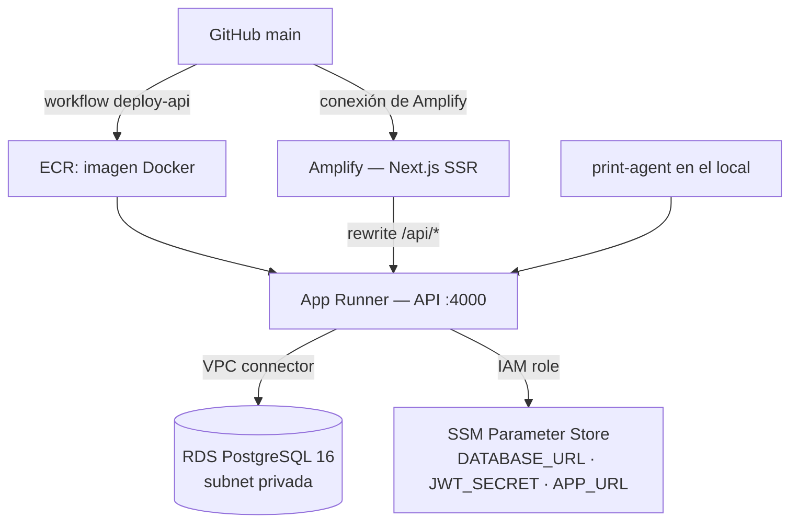

# 09 — Despliegue y operación

Región AWS: **eu-west-1 (Irlanda)**. Infraestructura declarada en `infra/` con Terraform.
Guía original de creación desde cero: [`infra/DEPLOY.md`](../infra/DEPLOY.md).

## 1. Topología en producción



| Recurso | Fichero Terraform | Notas |
|---------|-------------------|-------|
| VPC, subredes, IGW, SG | `vpc.tf` | RDS en subred privada, sin IP pública |
| RDS PostgreSQL 16 | `rds.tf` | `db.t3.micro` por defecto, `db_multi_az = false` |
| ECR + política de ciclo de vida | `ecr.tf` | |
| App Runner + conector VPC | `apprunner.tf` | 0.25 vCPU / 0.5 GB por defecto |
| Amplify | `amplify.tf` | Conexión con GitHub hecha **a mano** desde la consola |
| Roles y políticas IAM | `iam.tf` | Acceso a ECR y lectura de SSM |
| Parámetros cifrados | `ssm.tf` | `DATABASE_URL`, `JWT_SECRET` |
| Bucket S3 | `s3.tf` | Reservado; hoy no se usa desde el código |

> El estado de Terraform vive en **S3 con bloqueo en DynamoDB**
> (`comandapro-terraform-state-839380010537` / `comandapro-terraform-locks`, cifrado). El
> `infra/terraform.tfstate` local es un fichero vacío que quedó tras la migración: no lo
> uses ni te fíes de él.

### 🚨 Deriva entre Terraform y el servicio vivo

Comprobado el 2026-08-11 con `aws apprunner describe-service`:

| Variable | Declarada en `apprunner.tf` | Presente en el servicio vivo |
|----------|:---------------------------:|:----------------------------:|
| `NODE_ENV`, `APP_URL`, `ALLOWED_ORIGINS`, `ASSETS_BUCKET`, `ASSETS_BASE_URL` | ✅ | ✅ |
| `SMTP_HOST`, `SMTP_PORT`, `SMTP_SECURE`, `SMTP_USER`, `SMTP_PASS`, `SMTP_FROM` | ❌ | ✅ (añadidas a mano por consola) |

**Un `terraform apply` borraría las seis variables de SMTP** y el envío de correos dejaría
de funcionar. Y lo haría **en silencio**: `email.service.ts` traga los errores con
`.catch(console.error)`, así que no habría ni un 500 — simplemente los clientes dejarían de
recibir la verificación de cuenta y la confirmación de pedido.

Corregido en el parche del 2026-08-11: las seis variables ya están en `apprunner.tf` y
`SMTP_PASS` pasa a ser un secreto de SSM.

### 🚨 Amplify se desconectaría de GitHub

El mismo `terraform plan` destapó un segundo caso de deriva, más grave:

```
~ resource "aws_amplify_app" "web" {
  - repository = "https://github.com/lullaby11/comandapro-web" -> null
```

La conexión con GitHub se hizo desde la consola (Terraform no gestiona el token OAuth), así
que **cualquier `terraform apply` la habría borrado** y Amplify habría dejado de construir
el frontend al hacer push, sin más síntoma que dejar de desplegarse.

Corregido añadiendo `lifecycle { ignore_changes = [repository, oauth_token, access_token] }`
a `aws_amplify_app.web`.

> **Norma:** todo lo que se configure a mano en una consola de AWS y Terraform no pueda
> gestionar necesita un `ignore_changes` **en el mismo momento**, o se convierte en una
> bomba de relojería que estalla en el siguiente `apply`, meses después y sin relación
> aparente con el cambio que se estaba haciendo.

### Estado del plan tras el parche

```
Plan: 1 to add, 3 to change, 0 to destroy
```

- `aws_ssm_parameter.smtp_pass` — a crear (con valor de marcador; el real va aparte).
- `aws_apprunner_service.api` — variables de correo y `SMTP_PASS` movida a secreto.
- `aws_iam_policy.apprunner_ssm_read` — permiso de lectura del parámetro nuevo.
- `aws_iam_policy.github_actions` — deriva previa: la política del código ya incluía los
  permisos de snapshot de RDS y de rollback que el workflow usa, pero no se habían
  aplicado. Merece la pena aplicarlo: hoy el workflow depende de permisos concedidos a
  mano.

## 2. Despliegue del backend (automático)

`.github/workflows/deploy-api.yml` se dispara en push a `main` que toque `apps/api/**`:

1. **Snapshot de RDS previo** — `comandapro-db-predeploy-<timestamp>-<sha>`.
2. **Registra la imagen anterior** para poder revertir.
3. **Build y push** a ECR con dos etiquetas: `<sha>` y `latest`.
4. **`aws apprunner start-deployment`**.
5. **Espera** hasta 5 minutos a que el servicio quede en `RUNNING`.
6. **Resumen** en GitHub con las órdenes exactas de rollback.

Secretos requeridos en GitHub: `AWS_ACCESS_KEY_ID`, `AWS_SECRET_ACCESS_KEY`,
`RDS_DB_IDENTIFIER`, `ECR_REPOSITORY_NAME`, `APPRUNNER_SERVICE_ARN`.

### Migraciones de base de datos

El contenedor arranca con:

```
npx prisma migrate deploy && node dist/index.js
```

Es decir, **las migraciones se aplican en cada despliegue, sin ventana de mantenimiento**.
Consecuencias:

- Una migración que bloquee una tabla grande deja la API caída mientras dura.
- Si la migración falla, el contenedor no arranca y App Runner mantiene la versión anterior
  (buen comportamiento por defecto), pero la base ya puede estar a medias.
- **Regla:** migraciones siempre compatibles hacia atrás (columna nueva nullable → desplegar
  código → backfill → restringir en un segundo despliegue).

## 3. Despliegue del frontend

AWS Amplify conectado a GitHub, configuración en `amplify.yml`:

- `appRoot: apps/web`
- Instala manualmente los binarios nativos de Linux de Tailwind v4 y `lightningcss` y los
  copia a mano, porque Amplify no ejecuta `postinstall`. **No toques ese bloque sin probar
  el build completo**: es la causa de varios despliegues rotos históricos.
- Artefacto: `.next`, con caché de `.next/cache`.

`NEXT_PUBLIC_API_URL` y `NEXT_PUBLIC_APP_URL` se configuran como variables de entorno en la
consola de Amplify (se incrustan en el bundle **en tiempo de build**: cambiarlas exige
reconstruir).

**CORS:** la lista blanca vive en `ALLOWED_ORIGINS`. La configuración que manda en
producción es la de `infra/apprunner.tf` (`runtime_environment_variables`), porque el
despliegue es por imagen ECR; `apps/api/apprunner.yaml` solo aplicaría si App Runner
construyese desde el código.

> ⚠️ **La tienda online llama a la API entre orígenes distintos** (usa
> `NEXT_PUBLIC_API_URL` en absoluto). Si cambia el dominio desde el que se sirve la tienda,
> hay que añadirlo a `ALLOWED_ORIGINS` **antes** de desplegar, o los clientes finales dejan
> de poder pedir. Para comprobar la configuración viva:
>
> ```bash
> aws apprunner describe-service --service-arn "$APPRUNNER_SERVICE_ARN" \
>   --query 'Service.SourceConfiguration.ImageRepository.ImageConfiguration.RuntimeEnvironmentVariables'
> ```
>
> Si la variable no estuviera definida, la API se repliega al origen de `APP_URL` en lugar
> de abrirse a todo el mundo.

## 3 bis. Correo saliente con Amazon SES

Desde agosto de 2026 el correo se envía con la **API de Amazon SES autorizada por el rol de
instancia de App Runner**. No hay credenciales: ni contraseña, ni parámetro en SSM, ni nada
que rotar o que se pueda filtrar en un `describe-service`.

### Estado de la identidad (verificado el 2026-08-11)

| | |
|---|---|
| Región de SES | **eu-west-3** (el resto de la infraestructura está en eu-west-1; funciona entre regiones) |
| Dominio `olyda.app` | Verificado |
| DKIM | `SUCCESS` (Easy DKIM, 3 CNAME) |
| MAIL FROM propio `smtp.olyda.app` | `SUCCESS`, con `BehaviorOnMxFailure = USE_DEFAULT_VALUE` |
| Acceso a producción | **Concedido** — 50.000/día, 14/s, cuenta `HEALTHY` |

> El acceso a producción es crítico: en el *sandbox* de SES solo se puede enviar a
> direcciones verificadas, así que los correos de verificación a clientes reales fallarían.

### DNS pendiente

```
TXT   smtp.olyda.app     v=spf1 include:amazonses.com ~all
TXT   _dmarc.olyda.app   v=DMARC1; p=none; rua=mailto:BUZON@olyda.app
```

El MX de `smtp.olyda.app` ya apunta a `feedback-smtp.eu-west-3.amazonses.com`, pero falta
el TXT del SPF, y el dominio no tiene DMARC. Con DKIM ya alineado, DMARC en `p=none` da
informes sin bloquear nada; se sube a `p=quarantine` tras unas semanas limpias.

> Si `olyda.app` se usa además para correo corporativo, el SPF de la raíz tiene que incluir
> también a ese proveedor.

### Permisos

`infra/ses.tf` concede `ses:SendEmail` al rol de instancia, acotado a la identidad del
dominio **y** al remitente concreto:

```hcl
Condition = { StringEquals = { "ses:FromAddress" = var.mail_from_address } }
```

Sin esa condición, el permiso sobre la identidad de dominio permitiría enviar desde
cualquier dirección `@olyda.app`.

### Desplegar

```bash
cd infra
terraform plan    # esperado: 2 to add, 2 to change, 0 to destroy
terraform apply
```

El `apply` retira las seis variables `SMTP_*` (incluida la contraseña en claro) y añade
`MAIL_TRANSPORT`, `SES_REGION`, `MAIL_FROM_ADDRESS` y `MAIL_FROM_BRAND`.

> **Orden:** despliega primero el código y aplica Terraform después. Al arrancar, la API
> registra `[email] Transporte: ses (eu-west-3) · remitente: no-reply@olyda.app`, que
> confirma de un vistazo que la configuración cargó.

### Verificar

Registra una cuenta de prueba en la tienda online y comprueba que el correo llega, que el
remitente muestra el nombre del local y que el enlace de verificación funciona. Si algo
falla, los errores de SES aparecen en CloudWatch (el envío es *fire-and-forget*: no
devuelve error al usuario).

### Rastrear un correo concreto

Cada envío queda registrado en `/aws/events/comandapro/ses` (CloudWatch Logs, **eu-west-3**,
30 días de retención), vía el conjunto de configuración `comandapro-prod`.

Cuando un cliente diga que no le ha llegado el correo:

```bash
aws logs tail /aws/events/comandapro/ses --region eu-west-3 --since 24h --format short \
  | grep "correo@delcliente.com"
```

O con Logs Insights, para ver el desenlace de cada mensaje:

```
fields @timestamp, detail.eventType, detail.mail.destination.0 as destinatario,
       detail.delivery.smtpResponse as respuesta,
       detail.bounce.bounceType as rebote,
       detail.bounce.bouncedRecipients.0.diagnosticCode as motivo
| filter detail.mail.destination.0 = "correo@delcliente.com"
| sort @timestamp desc
```

Lectura de los eventos:

| Evento | Significado | Qué hacer |
|--------|-------------|-----------|
| `Send` | SES aceptó el mensaje | — |
| `Delivery` | El servidor receptor lo aceptó (`250 OK`) | Si el cliente no lo ve, **está en su spam o en la cuarentena de su organización**: SES ya no puede decir más |
| `Bounce` (Permanent) | Buzón inexistente o dominio caído | La dirección entra en la lista de supresión; corregirla |
| `Bounce` (Transient) | Buzón lleno, receptor caído | SES reintenta; si persiste, avisar al cliente |
| `Complaint` | **Alguien marcó el correo como spam** | Lo más grave: si la tasa sube, AWS suspende la cuenta. Investigar de inmediato |
| `DeliveryDelay` | El receptor está difiriendo | Suele resolverse solo |
| `Reject` | SES rechazó el envío (p. ej. virus) | Revisar el contenido |

> **Límite importante:** un `Delivery` no significa que el cliente lo haya visto. Para el
> servidor receptor, meter un correo en cuarentena **es** una entrega correcta. Ocurrió el
> 12/08/2026 con Office 365: los eventos decían `Delivery` y los mensajes estaban retenidos
> en la cuarentena del tenant. Ese diagnóstico solo se hace desde el lado receptor
> (en Microsoft 365: **security.microsoft.com → Quarantine**, y **Seguimiento de mensajes**
> en el centro de administración de Exchange).

### Identidad y DNS no están en Terraform

La identidad de SES, su DKIM y el MAIL FROM se verificaron desde la consola y **no** se
gestionan con Terraform, porque los registros DNS viven fuera de esta cuenta. Está anotado
en `infra/ses.tf` para que nadie intente "arreglar" esa ausencia importándolos a medias.

## 3 ter. Incidencia del 11/08/2026 — lecciones del primer despliegue real

El primer despliegue que pasó por el workflow desde mayo destapó tres problemas
encadenados. Ninguno causó caída, pero conviene tenerlos presentes.

### El pipeline llevaba roto desde mayo

Las ejecuciones #32, #33 y #34 fallaron en `Create pre-deployment RDS snapshot`: el usuario
`comandapro-github-actions` no tenía `rds:CreateDBSnapshot`. Los permisos **ya estaban en
`infra/iam.tf`**, pero nunca se habían aplicado. Mientras tanto los despliegues se hacían a
mano con `docker push`, lo que explica que la imagen en producción fuera del 8 de mayo.

> **Lección:** un `terraform plan` que lleva meses sin aplicarse no es deuda inerte; es una
> diferencia entre lo que crees que está desplegado y lo que hay. Revísalo periódicamente
> aunque no vayas a cambiar nada.

### El contenedor no arrancaba: P3005

```
Error: P3005 — The database schema is not empty
```

`prisma migrate deploy` se niega a operar sobre una base preexistente sin baseline.
Producción se creó con `db push` (deuda P2-9), así que no tenía registrada la migración
inicial. Era la **primera vez que se desplegaba la API desde que existe
`prisma/migrations/`** — la imagen anterior es del 8 de mayo y la migración se creó el 11 —
así que el problema estaba latente desde entonces.

Corregido en el `CMD` del Dockerfile con `migrate resolve --applied`, que marca la
migración como aplicada sin ejecutar su SQL. Ya está registrada en producción, así que a
partir de ahora ese comando falla de forma inocua y `migrate deploy` funciona con
normalidad.

> **Lo que salvó la situación:** App Runner mantiene la versión anterior mientras la nueva
> no supere el health check. El contenedor nuevo entró en bucle de reinicio y los clientes
> siguieron pidiendo con el código antiguo, sin enterarse. **No toques esa configuración.**

### Terraform no puede actualizar App Runner durante un despliegue

```
InvalidStateException: Service cannot be updated in the current state: OPERATION_IN_PROGRESS
```

Como `auto_deployments_enabled = true`, el push a `:latest` dispara un despliegue por su
cuenta, y `terraform apply` choca con él. **Espera a que el servicio esté `RUNNING` antes de
aplicar Terraform.**

### Orden correcto, ya validado

1. Merge a `main` → el workflow construye, sube la imagen y lanza el despliegue.
2. Esperar a `RUNNING` (`aws apprunner describe-service ... --query 'Service.Status'`).
3. `terraform apply`.
4. Esperar a `RUNNING` otra vez: el cambio de variables provoca un segundo reinicio.

## 4. Rollback

### Aplicación

```bash
./scripts/rollback.sh <SHA_ANTERIOR>
```

Requiere `AWS_REGION`, `ECR_REGISTRY`, `ECR_REPOSITORY_NAME`, `APPRUNNER_SERVICE_ARN`.
El script verifica que la imagen exista en ECR, la re-etiqueta como `latest` y lanza el
despliegue.

### Aplicación + base de datos

```bash
./scripts/rollback.sh <SHA_ANTERIOR> <SNAPSHOT_ID>
```

Restaurar un snapshot de RDS **crea una instancia nueva**: hay que repuntar
`DATABASE_URL` en SSM y redesplegar. Es una operación con pérdida de datos desde el
snapshot; úsala solo ante corrupción real.

## 5. Comprobaciones tras desplegar

```bash
curl -s https://<app-runner-host>/health
curl -s https://<app-runner-host>/api/public/<slug-de-un-local-con-tienda>
```

Y en el frontend: login → abrir servicio → crear pedido de prueba → imprimir → borrarlo.

## 6. Runbooks

### La API responde 500 en todo

1. Logs de App Runner en CloudWatch: `[Error]` incluye mensaje y stack.
2. Comprueba que las tres variables obligatorias existen (si falta una, el proceso muere al
   arrancar con `[startup] Missing required env vars`).
3. Comprueba la conectividad con RDS (grupo de seguridad y conector VPC).

### La base de datos no acepta conexiones

App Runner se conecta por el conector VPC. Revisa el grupo de seguridad de RDS
(`aws_security_group.rds`) y que el número de conexiones no esté agotado — Prisma abre un
pool por instancia y App Runner escala instancias: **con autoescalado agresivo se puede
agotar `max_connections` de una `db.t3.micro`**. Mitigación: limitar `connection_limit` en
la `DATABASE_URL` (`?connection_limit=5`) y acotar el máximo de instancias.

### Un local no puede imprimir

Ver la guía de incidencias en [06-impresion.md §4](06-impresion.md#4-guía-de-resolución-de-incidencias).

### Los emails no llegan

`email.service.ts` usa nodemailer con timeouts de 8–10 s y los fallos se registran con
`console.error` sin reintento. Revisa CloudWatch, las credenciales SMTP y el límite de
envíos del proveedor. **No hay cola ni reintentos**: si el SMTP estaba caído, ese email se
perdió para siempre.

### Hay que suspender un local moroso

Hoy **no existe** un mecanismo de suspensión. Alternativa manual: poner
`onlineOrderEnabled = false` y cambiar la contraseña del `OWNER`. Es una de las carencias a
resolver en la fase SaaS ([12-roadmap.md](12-roadmap.md)).

## 7. Costes aproximados (orden de magnitud)

| Servicio | Configuración | Coste mensual estimado |
|----------|---------------|------------------------|
| App Runner | 0,25 vCPU / 0,5 GB, siempre activo | 15–25 € |
| RDS | `db.t3.micro`, sin Multi-AZ | 15–20 € (gratis el primer año con free tier) |
| Amplify | build + hosting SSR | 5–15 € según tráfico |
| ECR / SSM / datos | | 1–5 € |
| **Total** | | **≈ 40–60 €/mes** |

Con el plan Básico hipotético de 29 €/mes, la infraestructura se cubre a partir del
**tercer local**. Cualquier decisión de arquitectura debe medirse contra ese margen.

## 8. Copias de seguridad

- Snapshot automático **antes de cada despliegue de la API** (workflow).
- RDS: `backup_retention_period = 7` días, `storage_encrypted = true`,
  `deletion_protection = true`, `skip_final_snapshot = false`, sin acceso público
  (`infra/rds.tf`). Configuración correcta.
- **No hay prueba de restauración periódica.** Un backup no probado no es un backup:
  planifica un simulacro trimestral y anota el resultado aquí.
